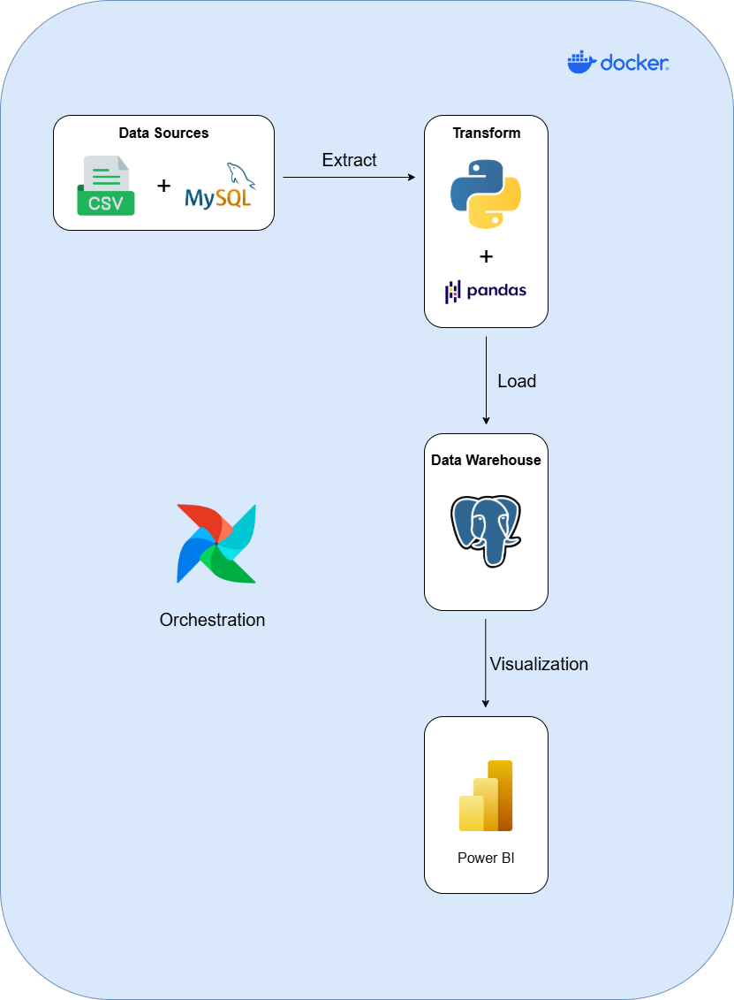
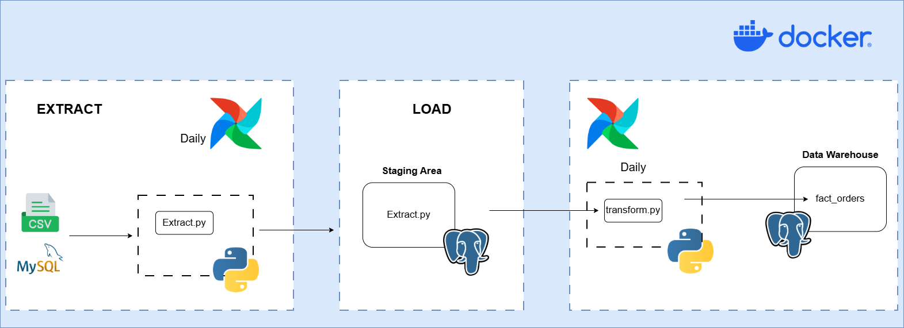
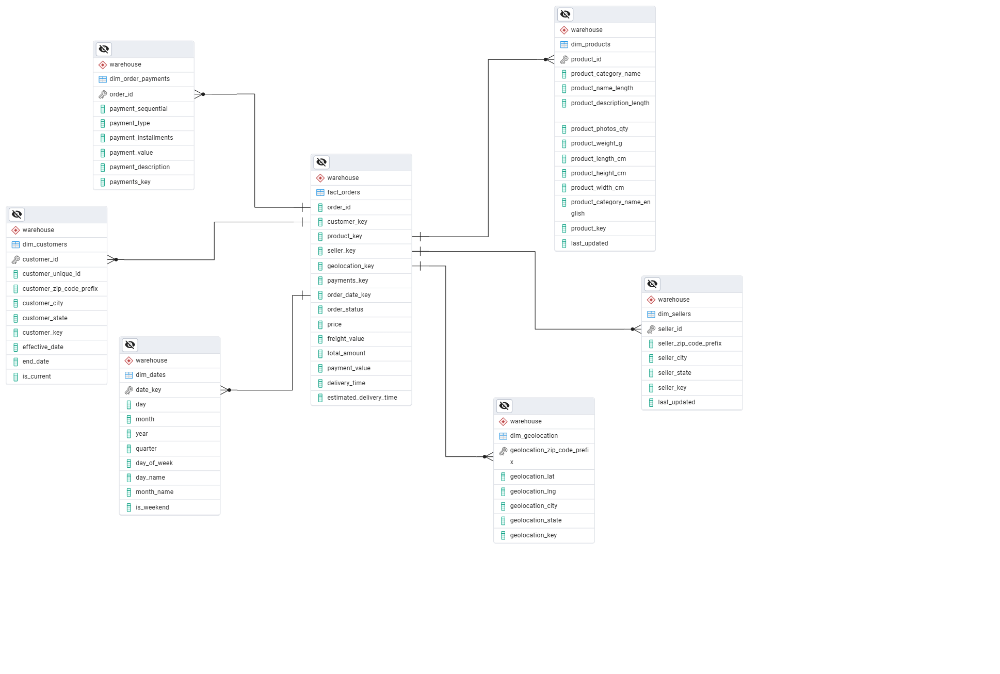
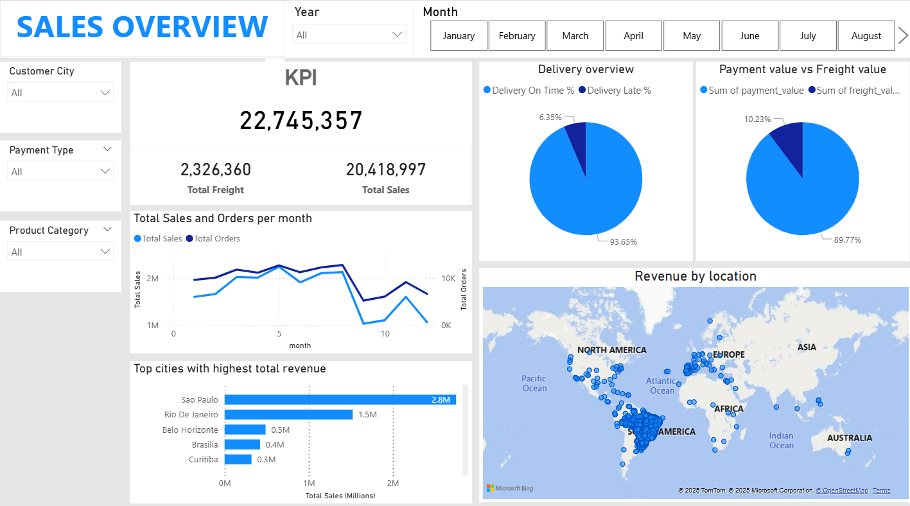
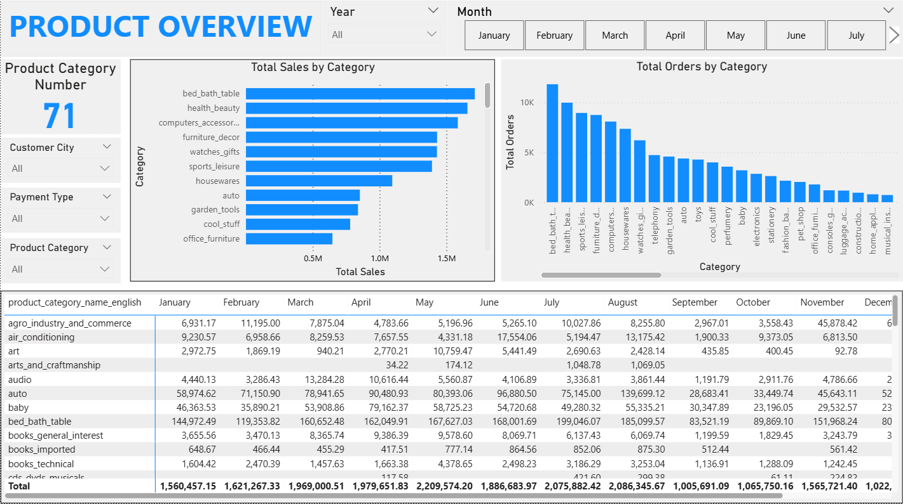

ETL Pipeline Project

This project builds an ETL (Extract - Transform - Load) pipeline using:
- Apache Airflow
- MySQL & PostgreSQL
- Docker

Dataset: https://www.kaggle.com/datasets/olistbr/brazilian-ecommerce

The project used Python and custom scripts to efficiently extract and load eCommerce data from CSV files and MySQL databases. PostgreSQL served as both the staging area and the final data warehouse, managing structured sales data.
The entire ETL workflow—from extraction to transformation—was orchestrated using Apache Airflow, ensuring smooth and automated operations. The project was containerized with Docker for consistent environment management and seamless deployment. Finally, Power BI was used for data visualization and sales analytics, providing valuable business insights.

 

Data Warehouse Mode

Airflow

Dashboard with Power BI

